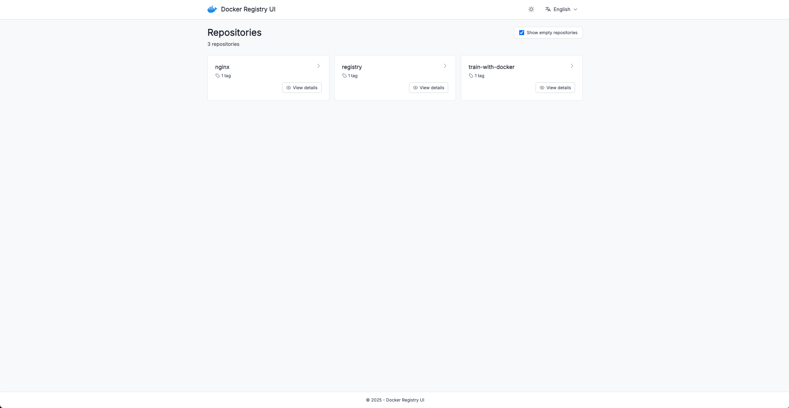
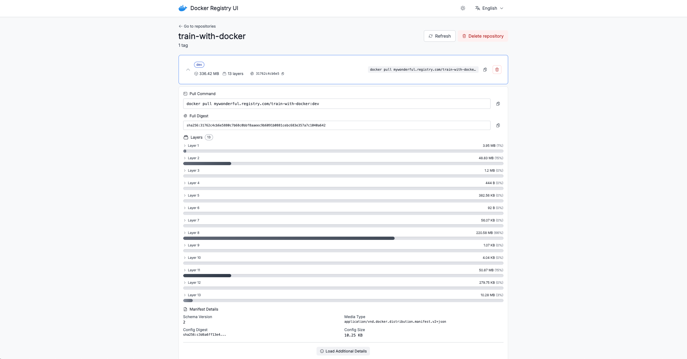

<div align="center">

# 🐳 Docker Registry UI

**A modern, open-source web interface for managing your Docker Registry**

Self-hosted • Secure • Mobile-First • No Database Required

[](https://opensource.org/licenses/MIT)
[](https://github.com/chichi13/registry-ui/discussions)

[](https://nuxt.com)
[](https://www.typescriptlang.org/)
[](https://tailwindcss.com/)

[Quick Start](#quick-start) • [Features](#features) • [Documentation](#documentation) • [Contributing](#contributing) • [Discussions](https://github.com/chichi13/registry-ui/discussions)

</div>

---

## Why Docker Registry UI?

Managing Docker images in a self-hosted registry shouldn't require complex tools or compromising on security. **Docker Registry UI** provides a clean, modern interface that works seamlessly with your existing Docker Registry V2 API infrastructure.

**Perfect for:**

- **Teams** managing private Docker images
- **Security-conscious** organizations requiring self-hosted solutions
- **DevOps teams** needing a lightweight registry management tool
- **Developers** who want a simple UI without vendor lock-in

**Key Advantages:**

- **100% Open Source** - MIT licensed, fully transparent
- **No Database** - Stateless architecture, all data from Registry API
- **Bring Your Own Auth** - Integrates with your reverse proxy authentication
- **Privacy First** - Self-hosted, your data stays on your infrastructure
- **Mobile Ready** - Responsive design optimized for all devices

---

## Features

### Security & Architecture

- **External Authentication** - Integrates with reverse proxy (Nginx, Caddy, Traefik) for Basic Auth/OAuth
- **Security First** - Must run behind authenticated reverse proxy, never exposed directly
- **Stateless Design** - No database required, all state managed through Registry API
- **Type-Safe** - Full TypeScript coverage with strict mode and Zod validation

### User Experience

- **Mobile-First Design** - Responsive UI optimized for all devices (mobile to desktop)
- **Dark Mode** - Automatic system preference detection with manual toggle
- **Internationalization** - Multi-language support (English, French)
- **Accessibility** - WCAG 2.1 AA compliant components with keyboard navigation
- **Performance** - Server-side rendering, optimized bundle (<500KB initial)

### Docker Registry Integration

- **Full V2 API Support** - Complete compatibility with Docker Registry V2 API
- **Smart Tag Deletion** - Intelligent three-tier deletion strategy (OCI API → Dummy Manifest → Digest fallback)
- **Repository Management** - Browse, search, and manage repositories and tags
- **Image Metadata** - View architecture, OS, size, and creation dates

### Developer Experience

- **Built with Nuxt 4** - Modern Vue 3 framework with Composition API
- **Quality Assured** - ESLint, Prettier, Git hooks, and comprehensive validation
- **Conventional Commits** - Standardized commit message format
- **Documentation** - Comprehensive guides for deployment and development

---

## Quick Start

Get up and running in minutes:

```bash
# Clone the repository
git clone https://github.com/chichi13/registry-ui.git
cd registry-ui

# Install dependencies
bun install

# Configure environment
cp .env.example .env
# Edit .env with your Docker Registry URL and credentials

# Start development server
bun run dev
```

The application will be available at `http://localhost:3000`.

**Production Deployment:** This application MUST be deployed behind a reverse proxy with authentication. See [Deployment Guide](#deployment-with-reverse-proxy) for details.

---

## Screenshots

### Homepage - Repository List



### Repository Details - Tags Management



---

## Documentation

### Configuration

#### Environment Variables

Create a `.env` file in the root directory:

| Variable                   | Required | Default        | Description                                                |
| -------------------------- | -------- | -------------- | ---------------------------------------------------------- |
| `NODE_ENV`                 | Yes      | `development`  | Environment mode (`development` or `production`)           |
| `HOST`                     | Yes      | `127.0.0.1`    | Host to bind                                               |
| `PORT`                     | Yes      | `3000`         | Port for the application server                            |
| `REGISTRY_URL`             | Yes      | -              | URL of your Docker Registry V2 API                         |
| `REGISTRY_USERNAME`        | No       | -              | Username for registry authentication                       |
| `REGISTRY_PASSWORD`        | No       | -              | Password for registry authentication                       |
| `REGISTRY_VERIFY_SSL`      | Yes      | `true`         | Verify SSL certificates (MUST be `true` in production)     |
| `REGISTRY_TOKEN_CACHE_TTL` | Yes      | `300`          | Token cache duration in seconds (60-3600)                  |
| `ENABLE_USER_LOGGING`      | No       | `false`        | Enable user logging from `X-Forwarded-User` header         |
| `REGISTRY_PUBLIC_URL`      | No       | `REGISTRY_URL` | This is the URL users should use in "docker pull" commands |

**Example Configuration:**

```env
NODE_ENV=production
HOST=127.0.0.1
PORT=3000

REGISTRY_URL=https://registry.example.com
REGISTRY_PUBLIC_URL=mypublicregistry.com
REGISTRY_USERNAME=admin
REGISTRY_PASSWORD=your-secure-password
REGISTRY_VERIFY_SSL=true
REGISTRY_TOKEN_CACHE_TTL=300
ENABLE_USER_LOGGING=true
```

---

### Deployment with Reverse Proxy

**CRITICAL:** This application MUST be deployed behind a reverse proxy with authentication. Never expose it directly to the internet.

**Architecture:**

```
Internet → Reverse Proxy (Auth) → Registry UI (localhost:3000) → Docker Registry
```

<details>
<summary><b>Nginx Configuration</b></summary>

```nginx
server {
    listen 443 ssl http2;
    server_name registry-ui.example.com;

    ssl_certificate /path/to/cert.pem;
    ssl_certificate_key /path/to/key.pem;

    # Basic Authentication
    auth_basic "Docker Registry UI";
    auth_basic_user_file /path/to/.htpasswd;

    location / {
        proxy_pass http://127.0.0.1:3000;
        proxy_set_header Host $host;
        proxy_set_header X-Real-IP $remote_addr;
        proxy_set_header X-Forwarded-For $proxy_add_x_forwarded_for;
        proxy_set_header X-Forwarded-Proto $scheme;
        proxy_set_header X-Forwarded-User $remote_user;
    }
}
```

</details>

<details>
<summary><b>Caddy Configuration</b></summary>

```caddy
registry-ui.example.com {
    basicauth {
        admin $2a$14$... # Use 'caddy hash-password' to generate
    }

    reverse_proxy 127.0.0.1:3000 {
        header_up X-Forwarded-User {remote_user}
    }
}
```

</details>

<details>
<summary><b>Traefik Configuration (docker-compose.yml)</b></summary>

```yaml
services:
  registry-ui:
    image: your-registry-ui:latest
    environment:
      - HOST=0.0.0.0 # Listen on all interfaces within container
      - REGISTRY_URL=https://registry.example.com
    labels:
      - 'traefik.enable=true'
      - 'traefik.http.routers.registry-ui.rule=Host(`registry-ui.example.com`)'
      - 'traefik.http.routers.registry-ui.entrypoints=websecure'
      - 'traefik.http.routers.registry-ui.tls.certresolver=letsencrypt'
      - 'traefik.http.routers.registry-ui.middlewares=registry-ui-auth'
      - 'traefik.http.middlewares.registry-ui-auth.basicauth.users=admin:$$apr1$$...'
    networks:
      - web
    # NO ports exposed - only via Traefik

networks:
  web:
    external: true
```

</details>

---

### Docker Deployment

<details>
<summary><b>Docker Compose Example</b></summary>

```yaml
version: '3.8'

services:
  registry-ui:
    build: .
    environment:
      - HOST=0.0.0.0
      - PORT=3000
      - NODE_ENV=production
      - REGISTRY_URL=https://registry.example.com
      - REGISTRY_USERNAME=admin
      - REGISTRY_PASSWORD=${REGISTRY_PASSWORD}
      - REGISTRY_VERIFY_SSL=true
    # NO ports exposed - use reverse proxy
    restart: unless-stopped
```

</details>

<details>
<summary><b>Building Docker Image</b></summary>

```bash
# Build the image
docker build -t registry-ui:latest .

# Run with environment variables
docker run -d \
  --name registry-ui \
  -e HOST=0.0.0.0 \
  -e REGISTRY_URL=https://registry.example.com \
  -e REGISTRY_USERNAME=admin \
  -e REGISTRY_PASSWORD=secret \
  registry-ui:latest
```

</details>

---

### Development

**Commands:**

```bash
# Development
bun run dev              # Start development server
bun run dev-https        # Start development server with HTTPS

# Production
bun run build            # Build for production
bun run start            # Start production server
bun run start:local      # Start production server with local .env
bun run preview:static   # Preview production build (static)

# Code Quality
bun run lint             # Lint code
bun run lint:fix         # Lint fix
bun run prettier:check   # Check code formatting
bun run prettier:fix     # Fix code formatting
```

**Code Quality Standards:**

- **ESLint** - Security rules, import order, TypeScript best practices
- **Prettier** - Consistent code formatting (single quotes, no semicolons)
- **TypeScript** - Strict mode with additional checks
- **Git Hooks** - Pre-commit linting, formatting, and type-checking
- **Conventional Commits** - Standardized commit message format

---

### Troubleshooting

<details>
<summary><b>Authentication failures</b></summary>

- Verify `REGISTRY_USERNAME` and `REGISTRY_PASSWORD` are correct
- Check if registry requires authentication (some allow anonymous read)
- Ensure bearer token authentication is supported by your registry

</details>

<details>
<summary><b>Cannot delete images</b></summary>

- Docker Registry must have `REGISTRY_STORAGE_DELETE_ENABLED=true`
- Ensure your registry version supports deletion
- Check user has write permissions on the registry

**Tag Deletion Strategies:**

This application uses an intelligent **three-tier approach** to delete Docker tags:

1. **OCI Tag Delete API** (Future-proof) - Uses official OCI Distribution Spec v1.0+ endpoint
2. **Dummy Manifest Workaround** (Current solution) - Proven approach used by professional tools like `regctl`
3. **Digest Deletion** (Last resort) - Traditional deletion with warning about affecting all tags

See the [full technical documentation](CLAUDE.md) for detailed implementation.

</details>

---

## Contributing

We welcome contributions from the community! Whether it's bug reports, feature requests, documentation improvements, or code contributions, every contribution makes a difference.

**Want to suggest a feature?** Join the discussion on [GitHub Discussions](https://github.com/chichi13/registry-ui/discussions)!

### How to Contribute

1. **Fork** the repository
2. **Create** a feature branch (`git checkout -b feat/amazing-feature`)
3. **Commit** your changes using [Conventional Commits](https://www.conventionalcommits.org/)

   ```
   feat(ui): add repository deletion confirmation dialog

   Implements a confirmation dialog using Reka UI AlertDialog
   to prevent accidental repository deletions.

   Closes #42
   ```

4. **Push** to your branch (`git push origin feat/amazing-feature`)
5. **Open** a Pull Request

### Development Guidelines

- Read our [Contributing Guidelines](CONTRIBUTING.md)
- Check existing issues before opening new ones
- Write clear commit messages using Conventional Commits
- Add tests for new features when applicable

---

### Community

- [GitHub Discussions](https://github.com/chichi13/registry-ui/discussions) - Ask questions, share ideas
- [GitHub Issues](https://github.com/chichi13/registry-ui/issues) - Report bugs and request features

### Tech Stack

- Built with [Nuxt 4](https://nuxt.com/) - The Intuitive Vue Framework
- UI components powered by [Reka UI](https://reka-ui.com/) - Accessible, unstyled components
- Styled with [Tailwind CSS](https://tailwindcss.com/) - Utility-first CSS framework
- Validation with [Zod](https://zod.dev/) - TypeScript-first schema validation

---

## Security

Security is a top priority for Docker Registry UI. If you discover a security vulnerability, please follow our [Security Policy](SECURITY.md).

**Important:**

- Never open a public issue for security vulnerabilities
- Do not disclose the vulnerability publicly before it's fixed
- Report security issues via private security advisory on GitHub

---

## License

This project is licensed under the **MIT License** - see the [LICENSE](LICENSE) file for details.

**What this means:**

- Free to use, modify, and distribute
- Can be used in commercial projects
- No warranty provided
- Attribution required

---

An AI assistant was used for this project (Claude Code / Cursor).

<div align="center">

**⭐ If you find Docker Registry UI useful, please consider giving it a star on GitHub!**

[GitHub](https://github.com/chichi13/registry-ui) • [Discussions](https://github.com/chichi13/registry-ui/discussions) • [Issues](https://github.com/chichi13/registry-ui/issues)

</div>
